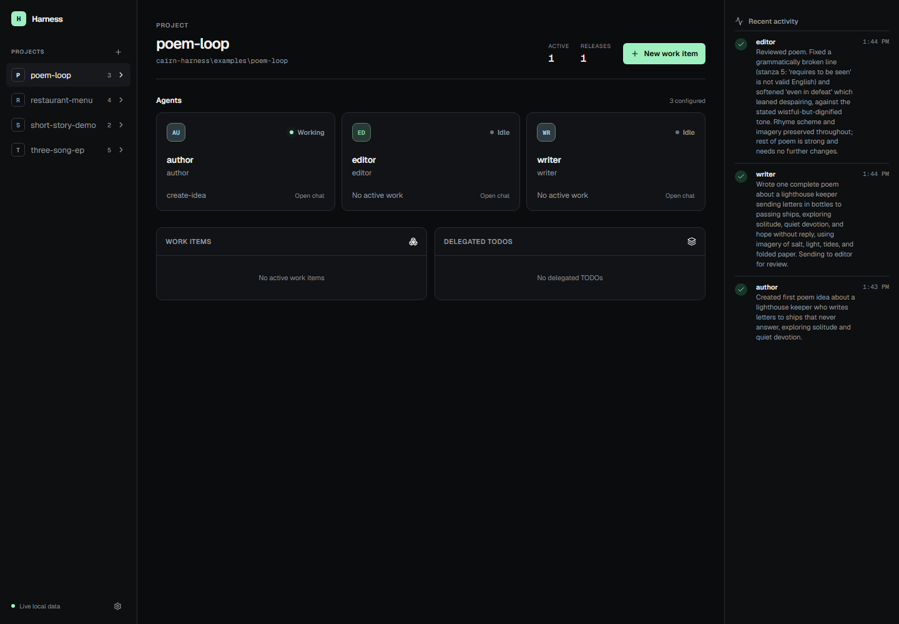

# Harness

A lightweight local app for running teams of GitHub Copilot CLI agents in the
background. Agents keep their sessions, share work, recover after restarts, and
stay visible in one chat-first UI.



## Start

Install Rust, Node.js 20+, and GitHub Copilot CLI. Sign in once:

```powershell
copilot login
```

Then launch the app:

```powershell
.\start.ps1
```

The dashboard opens at `http://127.0.0.1:3100`. Starting the UI also starts one
worker for every configured project. Startup installs the bundled
`cairn-harness` skill for both Copilot and Claude so either client can create
teams, assign a leader, submit delegated work, and message individual agents.

For UI development, use dev mode instead: it skips the production build/start
cycle and serves the dashboard with Next.js Fast Refresh, so most UI edits
apply in place in well under a second.

```powershell
.\start.ps1 -Dev
```

It still builds the Rust binary once if `target\release\cairn-harness.exe` is
missing, but does not rebuild it on every launch. Rebuild manually
(`cargo build --release`) after changing Rust source, then restart the
project's worker from the dashboard to pick it up.

To install or refresh only the skills after building the binary:

```powershell
.\target\release\cairn-harness.exe install
```

## Use

Create a project from the left rail, add agents, and start messaging or adding
work. Each agent has its own durable Copilot session and identity color.
Agents in one project share a project-local Cairn brain and skill catalog at
`.cairn-harness/cairn/cairn.db`. Harness does not copy personal Copilot skills
into agent profiles, and separate local projects cannot read each other's Cairn
state.

The conversation shows:

- Your messages
- Agent replies
- Messages between agents
- Completed turns
- Tool activity
- Session starts, stops, and restored history

Project state lives in `.cairn-harness/`. Closing and reopening the app does not
discard messages, work, or agent sessions.

## Telemetry

Read only actionable project findings:

```powershell
.\target\release\cairn-harness.exe --config <project.json> telemetry
.\target\release\cairn-harness.exe --config <project.json> telemetry inspect <id>
```

Use `--json` for automation and `--hours <1-720>` to change the window. Telemetry
stores counts, timings, fingerprints, version identity, and source pointers, not
prompt, response, command, tool-result, credential, or file content.
The default reader prints a fixed action table with human durations and short
affected identifiers. It reports only findings observed in the current running
release or the last six hours, while `inspect` retains bounded source evidence.

## Project file

Projects can also be defined with a small JSON file:

```json
{
  "name": "example-product",
  "root": ".",
  "leader": "pm",
  "roles": [
    {
      "name": "pm",
      "description": "Product manager",
      "prompt": "Define scope, delegate work, and verify the result."
    },
    {
      "name": "builder",
      "description": "Software engineer",
      "prompt": "Implement assigned work and report what changed."
    }
  ]
}
```

Set `HARNESS_PROJECTS` to a semicolon-separated list of project files before
launching the app. The included examples are discovered automatically.

## Development

```powershell
cargo test
cd ui
npm run test:e2e
```
